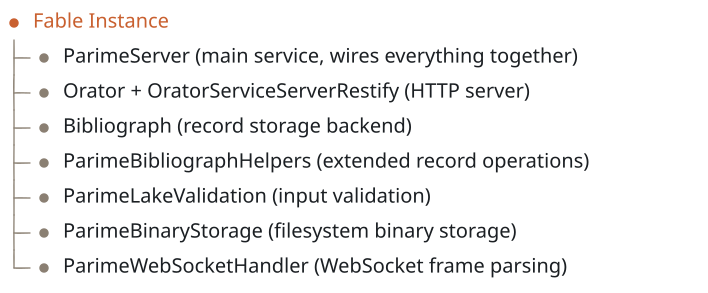

# Architecture

Parime is structured as a set of Fable services and Orator endpoints that together provide a data lake server.

## Service Architecture

<!-- bespoke diagram: edit diagrams/service-architecture.mmd or .hints.json, then: npx pict-renderer-graph build modules/meadow/parime/docs -->


## Lake Types

Parime provides three types of data lakes, each serving a different storage pattern.

### Record Lakes

Record lakes store JSON objects in scoped categories. Each record is identified by a category name and a hash (key). Under the hood, records are stored and retrieved through Bibliograph, which provides change tracking via metadata and delta history.

Routes are mounted at `/1.0/Record/:category/:hash`.

### Binary Lakes

Binary lakes store raw binary data on the local filesystem. The binary storage service maps categories and hashes to a nested directory structure under the configured storage root. Forward slashes in the hash create nested subdirectories, so a key like `2024/photos/vacation.jpg` results in the directory structure `{root}/{category}/2024/photos/vacation.jpg`.

Binary reads support HTTP byte-range requests per RFC 7233, allowing clients to request specific byte ranges of a file. This is useful for resumable downloads, media streaming, and partial content retrieval.

Routes are mounted at `/1.0/Binary/:category/:hash`.

### Combined Lakes

Combined lakes pair a JSON record with a binary file under the same category and hash. Rather than introducing a new storage mechanism, combined lakes delegate to the existing record and binary services through `/Record` and `/File` sub-endpoints.

Listing keys in a combined lake returns the union of all record and binary keys with flags indicating which components are present for each key.

Routes are mounted at `/1.0/Combined/:category/:hash/Record` and `/1.0/Combined/:category/:hash/File`.

## Services

### ParimeLakeValidation

Validates incoming request parameters before they reach the storage layer.

- **Category names** must start with an alphabetic character and contain only alphanumeric characters, hyphens and underscores.
- **Hashes** must be non-empty strings.
- **Binary paths** are sanitized to prevent path traversal attacks. Segments containing `..`, `.`, absolute paths and backslashes are rejected.

### ParimeBinaryStorage

Manages binary files on the local filesystem. The storage root directory is configured via `ParimeBinaryStorageRoot` in the Fable settings. Files are organized under `{root}/{category}/{path segments from hash}`.

Key operations:
- `write(category, hash, buffer, callback)` - Write binary data, creating nested directories as needed
- `read(category, hash, callback)` - Read the full file into a buffer
- `readStream(category, hash, options)` - Return a readable stream with optional `start`/`end` for byte-range serving
- `stat(category, hash, callback)` - Get file statistics (size, timestamps)
- `listKeys(category, callback)` - Recursively list all file keys in a category, reconstructing slash-separated keys from the directory tree

### ParimeBibliographHelpers

Provides additional record operations that bridge the gap between the published Bibliograph npm API and the needs of the data lake. These include checking record existence, listing record keys in a category, and reading delta history.

### ParimeWebSocketHandler

Handles WebSocket connections from raw TCP sockets after the Restify upgrade handshake. Performs the WebSocket protocol handshake (SHA-1 hash with the magic GUID), parses incoming frames, dispatches JSON messages to the appropriate lake operations, and sends response frames back to the client.

## Request Flow

```
HTTP Request
  -> Restify (routing, body parsing)
    -> Orator (service server abstraction)
      -> Endpoint (RecordLake, BinaryLake, CombinedLake)
        -> Validation (ParimeLakeValidation)
          -> Storage (Bibliograph or ParimeBinaryStorage)
            -> Response

WebSocket Upgrade Request
  -> Restify (route match, claimUpgrade)
    -> Endpoint-WebSocket (handshake)
      -> ParimeWebSocketHandler (frame parsing, message dispatch)
        -> Storage (Bibliograph or ParimeBinaryStorage)
          -> WebSocket Response Frame
```
